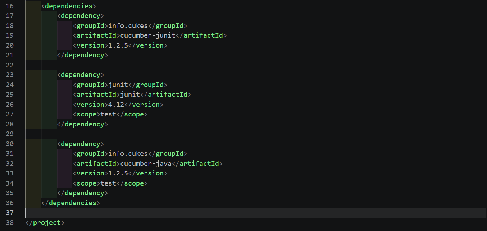

# گزارش آزمایش ۴: توسعه مبتنی بر رفتار

## مشخصات

- نام: Sahand Akramipour
- شماره دانشجویی: 401110618
- درس: آزمایشگاه مهندسی نرم‌افزار
- دانشگاه: دانشگاه صنعتی شریف
- هم‌گروهی: ندارد
- لینک مخزن: [repo-link](https://github.com/shndap/selab_hw4)

## هدف آزمایش

هدف این آزمایش، پیاده‌سازی و ارزیابی یک نمونه ساده از توسعه مبتنی بر رفتار
(`Behavior-Driven Development`) با استفاده از `Cucumber` و `Gherkin` بود.
در این فرایند، ابتدا یک پروژه جاوا ایجاد شد، سپس سناریوهای تست به‌صورت
`Feature` و `Scenario Outline` تعریف شدند و در ادامه، منطق برنامه و
`Step Definition`‌ها به‌گونه‌ای نوشته شدند که تست‌ها با موفقیت اجرا شوند.

## ابزارها و محیط اجرا

- `VS Code`
- افزونه `Maven for Java`
- `Gherkin extension` برای ویرایش فایل‌های feature
- `Java 17`
- `Maven`
- `Cucumber`

## مراحل انجام کار

### ۱. آماده‌سازی پروژه

در ابتدا پروژه با استفاده از `VS Code` و افزونه `Maven for Java` آماده شد و
وابستگی‌های موردنیاز در فایل `pom.xml` اضافه شدند.



سپس پروژه با دستور زیر build شد:

```bash
mvn package
```

خروجی موفق اجرای این مرحله در تصویر زیر دیده می‌شود:


### ۲. ایجاد ساختار Gherkin

در این مرحله، فایل feature و ساختار پوشه‌های لازم برای `Cucumber` ایجاد شد.
برای این کار از افزونه `Gherkin` در `VS Code` استفاده شد.


### ۳. پیاده‌سازی Step Definition و کلاس Calculator

ابتدا فایل `MyStepdefs.java` نوشته شد و همان‌طور که انتظار می‌رفت، در این
مرحله برخی خطاها وجود داشت؛ چون کلاس‌های اصلی هنوز کامل نشده بودند.


سپس فایل `Calculator.java` در مسیر مناسب پروژه ایجاد شد تا منطق محاسباتی را
در خود نگه دارد.


### ۴. اجرای اولیه تست‌ها

بعد از تکمیل بخش‌های اصلی، تست‌ها با دستور زیر اجرا شدند:

```bash
mvn test
```

در این مرحله مشخص شد که نسخه `Cucumber` مورد استفاده با `Java 17` کاملاً
سازگار نبود و نیاز به به‌روزرسانی وابستگی‌ها وجود داشت.


### ۵. اصلاح وابستگی‌ها و به‌روزرسانی سینتکس

برای رفع مشکل سازگاری، وابستگی‌های پروژه به نسخه‌های مناسب‌تر تغییر داده شدند.


همچنین فایل `MyStepdefs.java` با سینتکس جدید و سازگارتر بازنویسی شد تا با
نسخه‌های جدید `Cucumber` هماهنگ باشد.


در ادامه، یک `Runner` برای اجرای تست‌های `Cucumber` ساخته شد.


پس از این تغییرات، اجرای مجدد تست‌ها با `mvn test` بدون خطا انجام شد.


نمونه سناریوی اولیه:

```gherkin
@tag
Scenario: add two numbers
  Given Two input values, 1 and 2
  When I add the two values
  Then I expect the result 3
```

> پایان commit `c51e579ad0f8d18f4f5a34634c596724ad83817f`

### ۶. استفاده از Scenario Outline

در ادامه، فایل Gherkin به‌گونه‌ای تغییر کرد که از `Scenario Outline` و
جای‌گذاری پارامترها استفاده کند.


با وجود این تغییر، اجرای تست‌ها همچنان موفق بود؛ زیرا `Runner` و پیاده‌سازی
کد به‌صورت نسبتاً مقاوم نوشته شده بودند.


نمونه سناریوهای جدید:

```gherkin
@tag
Scenario Outline: add two numbers
  Given Two input values, 1 and 12
  When I add the two values
  Then I expect the result 13

@tag
Scenario Outline: add two numbers
  Given Two input values, -1 and 6
  When I add the two values
  Then I expect the result 5

@tag
Scenario Outline: add two numbers
  Given Two input values, 2 and 2
  When I add the two values
  Then I expect the result 4
```

> پایان commit `9d828289854c4040768b4130e6b9522222e7aff0`

### ۷. پاسخ به سؤال تحلیلی

در نسخه اولیه‌ی آزمایش، سناریوها فقط برای ورودی‌های مشخص `1` و `2` نوشته
شده بودند و از قالب عمومی `<first>` و `<second>` به‌صورت کامل استفاده
نمی‌کردند. با این حال، نسخه‌ای از کد که در این آزمایش استفاده شد، ورودی‌های
عمومی‌تر را نیز پشتیبانی می‌کرد؛ بنابراین اجرای تست‌ها بدون خطا ادامه پیدا
کرد.

### ۸. افزودن عملگر به تست‌ها

در مرحله بعد، تست‌ها به‌گونه‌ای توسعه داده شدند که علاوه بر دو مقدار عددی،
یک عملگر نیز دریافت کنند.


سپس فایل‌های `MyStepdefs.java` و `Calculator.java` متناسب با این تغییر
به‌روزرسانی شدند.


پس از اعمال این تغییرات، تست‌ها همچنان با موفقیت اجرا شدند.


### ۹. گسترش مثال‌ها

در ادامه، مجموعه مثال‌ها برای پشتیبانی از چند عملگر مختلف گسترش داده شد:

```gherkin
Examples:
    | first | second | opt | result |
    | 6     | 2      | *   | 12     |
    | 6     | 2      | /   | 3      |
    | 6     | 2      | +   | 8      |
    | 6     | 2      | -   | 4      |
    | 2     | 3      | ^   | 8      |
```

اجرای تست‌ها در این حالت نیز بدون مشکل انجام شد.


نمونه نهایی سناریوها:

```gherkin
@tag
Scenario Outline: add two numbers
  Given Two input values, 6 and 2, and an operator "*"
  When I apply the operator on the two values
  Then I expect the result 12

@tag
Scenario Outline: add two numbers
  Given Two input values, 6 and 2, and an operator "/"
  When I apply the operator on the two values
  Then I expect the result 3

@tag
Scenario Outline: add two numbers
  Given Two input values, 6 and 2, and an operator "+"
  When I apply the operator on the two values
  Then I expect the result 8

@tag
Scenario Outline: add two numbers
  Given Two input values, 6 and 2, and an operator "-"
  When I apply the operator on the two values
  Then I expect the result 4

@tag
Scenario Outline: add two numbers
  Given Two input values, 2 and 3, and an operator "^"
  When I apply the operator on the two values
  Then I expect the result 8
```

> پایان commit `866d08e622195f8a1f77e609e2cc12fd2f440b0d`

## جمع‌بندی

در این آزمایش، یک پروژه ساده‌ی محاسبه‌گر با رویکرد `BDD` پیاده‌سازی شد و
مراحل اصلی کار با `Cucumber` شامل تعریف سناریوها، نوشتن `Step Definition`،
ساخت `Runner`، رفع ناسازگاری نسخه‌ها و توسعه تست‌های پارامتری تمرین شد.

نتیجه نهایی این بود که:

- ساختار پروژه به‌درستی آماده شد.
- تست‌ها پس از اصلاح وابستگی‌ها و کدها با موفقیت اجرا شدند.
- سناریوها از حالت ساده به حالت پارامتری و قابل‌گسترش ارتقا پیدا کردند.
- پیاده‌سازی نهایی توانست عملگرهای مختلف را نیز پشتیبانی کند.
